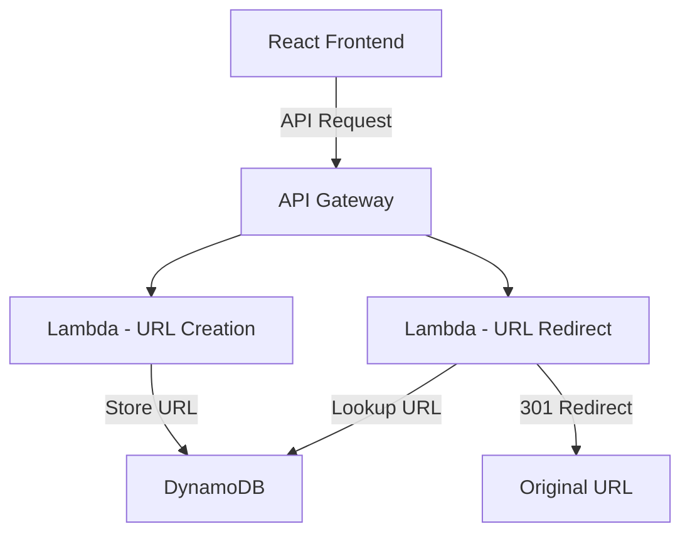

# 🔗 URL Shortener

A modern, secure URL shortening service built with React, TypeScript, and AWS serverless architecture.


## 🚀 Features

- **Instant URL Shortening**: Generate short, unique URLs in milliseconds
- **Secure Redirection**: AWS Lambda-powered secure URL redirection
- **Modern UI**: Clean, responsive interface built with React and Tailwind CSS
- **Serverless Architecture**: Scalable AWS infrastructure with DynamoDB
- **TypeScript**: Full type safety across the entire codebase

## 🏗️ Architecture



## 🛠️ Tech Stack

- **Frontend**
  - React 18
  - TypeScript
  - Tailwind CSS
  - Vite
  - Lucide React Icons

- **Backend**
  - AWS Lambda
  - Amazon DynamoDB
  - AWS API Gateway

- **Development**
  - ESLint
  - PostCSS
  - Node.js

## 📁 Project Structure

```
url-shortener/
├── backend/
│   └── lambda/
│       └── redirect/
│           ├── index.js
│           └── package.json
├── src/
│   ├── config/
│   │   └── aws-config.ts
│   ├── App.tsx
│   ├── main.tsx
│   └── index.css
├── public/
├── .env
└── package.json
```

## 🚦 Getting Started

1. **Clone the repository**
   ```bash
   git clone https://github.com/yourusername/url-shortener.git
   cd url-shortener
   ```

2. **Install dependencies**
   ```bash
   npm install
   ```

3. **Configure environment variables**
   Create a `.env` file in the root directory:
   ```env
   VITE_AWS_ACCESS_KEY_ID=your_access_key
   VITE_AWS_SECRET_ACCESS_KEY=your_secret_key
   VITE_API_GATEWAY_URL=your_api_gateway_url
   ```

4. **Start the development server**
   ```bash
   npm run dev
   ```

## 🌐 AWS Setup

1. **Create DynamoDB Table**
   - Table Name: `url-mappings`
   - Partition Key: `short_id` (String)
   - Add GSI for `long_url` if needed

2. **Deploy Lambda Functions**
   - Upload the contents of `backend/lambda/redirect`
   - Configure environment variables
   - Set up API Gateway triggers

3. **Configure API Gateway**
   - Create new REST API
   - Set up routes for URL creation and redirection
   - Enable CORS
   - Deploy to stage

## 📝 Environment Variables

| Variable | Description |
|----------|-------------|
| `VITE_AWS_ACCESS_KEY_ID` | AWS IAM user access key |
| `VITE_AWS_SECRET_ACCESS_KEY` | AWS IAM user secret key |
| `VITE_API_GATEWAY_URL` | AWS API Gateway endpoint URL |

## 🔒 Security Considerations

- Use AWS IAM roles with minimal required permissions
- Enable CORS with specific origins
- Implement rate limiting on API Gateway
- Regular security audits and dependency updates

## 🤝 Contributing

1. Fork the repository
2. Create your feature branch (`git checkout -b feature/AmazingFeature`)
3. Commit your changes (`git commit -m 'Add some AmazingFeature'`)
4. Push to the branch (`git push origin feature/AmazingFeature`)
5. Open a Pull Request

## 📄 License

This project is licensed under the MIT License - see the [LICENSE](LICENSE) file for details.